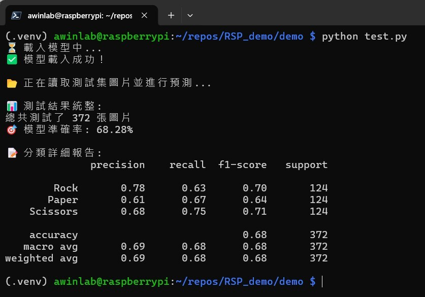

# AIOT 智慧物聯網：手勢辨識系統(Raspberry Pi 刷機與電腦視覺)報告

> **專案原始碼連結**：[GitHub Repository](https://github.com/KungTan/aiot_hm4)
> **AI 協作對話紀錄**：[chat.md](chat.md)

本報告為此專案之技術總結

---

## 壹、Raspberry Pi 4 終端設備執行驗證

為確保系統能在邊緣運算設備上順利運作，我們已將開發完成的程式碼部署至 Raspberry Pi 4 進行測試。

<div align="center">
  
  
</div>

以上圖片為成功執行 `test.py` 與 `carema.py` 的終端機截圖紀錄，證實環境建置與程式邏輯皆正常運作。

---

## 貳、系統即時辨識 Demo 展示影片

為展現我們所挑選的最佳模型（MobileNetV3Small）的實際效能，我們錄製了一段即時推論的 Demo 影片。在影片中，我們總共執行了超過 10 次的手勢辨識測試。

👉 **[點此觀看即時手勢辨識 Demo 影片](https://youtu.be/dyrgbQMkEnE)**

**影片展示重點：**

1. **三大標準手勢**：穩定辨識 石頭 (Rock)、剪刀 (Scissors)、布 (Paper)。
2. **防呆與例外處理**：當畫面中出現非定義的手勢，或是沒有手勢時，系統會正確判定並顯示為「**Error**」，完美解決了作業要求。

---

## 參、模型架構比較與修改深度解析

> **💡 核心決策：為何更換模型？ (捨棄傳統機器學習)**  
> 在本作業中，我們發現原始範例所使用的機器學習演算法（如 SVM、Random Forest）在處理影像時，因為必須將二維的圖片像素展平（Flatten）為一維陣列，導致完全喪失了影像的空間結構與平移不變性（Translation Invariance）。這造成只要手勢稍微偏離畫面正中央，模型就會嚴重誤判。為了解決這個痛點，我們決定全面升級為**卷積神經網路 (CNN)** 進行遷移學習。

### 1. 模型選擇與效能指標分析

我們將輸入影像統一縮放為 `96x96` 的 RGB 格式，並挑選了兩款知名且具代表性的神經網路進行訓練與比較：

* **MobileNetV3Small**：Google 專為行動裝置與邊緣運算設備量身打造的輕量級神經網路，具備極低的運算成本與參數量。
* **DenseNet121**：經典的深層卷積神經網路，以密集連接（Dense Connectivity）著稱，能有效緩解梯度消失問題並強化特徵重用。

| 模型架構 (Architecture) | Accuracy | Precision | Recall | F1-Score | 模型特性與優勢 |
| :--- | :--- | :--- | :--- | :--- | :--- |
| **🥇 MobileNetV3Small** | **0.9462** | **0.9525** | **0.9462** | **0.9455** | 推論極快、適合終端、收斂穩定 |
| DenseNet121 | 0.8306 | 0.8877 | 0.8306 | 0.8286 | 特徵重用能力強，但易過擬合 |

**結論：** 基於其高達 `94.62%` 的準確率以及極輕量的運算負擔，我們最終選擇 **MobileNetV3Small** 作為最終推論模型。

### 2. 深入解釋模型比較與差異分析

> **🔍 為什麼 MobileNetV3Small 會贏過更深層的 DenseNet？**

* **MobileNetV3Small (表現優異)**：它採用了深度可分離卷積（Depthwise Separable Convolutions），使得它在參數量極小的狀況下依然有強大的表達能力。在我們約 2500 張的小型資料集上，它不僅沒有發生過擬合（Overfitting），反而非常順利地收斂到極高的準確率，證明了輕量化模型在小資料集上的優勢。
* **DenseNet121 (表現落敗)**：雖然這是一個強大的架構，但因為其網路深度較高，在我們相對受限的資料集大小下，反而發生了模型過於複雜而導致的「過擬合」現象，或是需要更多的 Epoch 才能發揮實力。這導致其最終測試 Accuracy 僅停留在 `83.06%`。

### 3. 首創「時間平滑」之 Error 判斷機制

題目要求系統必須能判斷出「其他錯誤手勢 (Error)」。我們在 `demo_dl_camera.py` 中實作了創新的雙重防護機制：

1. **信心度門檻 (Threshold)**：將門檻設定為 **0.75 (75%)**。若模型預測機率達不到此標準，系統便會輸出 **Error**，以醒目的紅色標示。
2. **時間平滑技術 (Temporal Smoothing)**：導入了 **Queue (佇列)** 的概念，將過去 3 幀的機率進行「移動平均」。這個機制宛如為系統加上了避震器，使得輸出的預測結果異常穩定，大幅優化了使用者的操作體驗。

---

## 肆、專案 Demo 系統特色與互動體驗介紹

為了讓手勢辨識系統不僅僅停留在終端機印出文字的階段，我們針對 `demo_dl_camera.py` 設計了具備高度互動性與視覺回饋的即時影像介面：

1. **直覺的感測區域 (ROI, Region of Interest)**
   * 我們在畫面正中央繪製了一個藍色的 `300x300` 矩形框，明確提示使用者應將手勢放置於該區域內。
   * 此舉不僅提升了操作直覺性，也確保了擷取到的影像比例與訓練時（`96x96`）一致，避免了影像被拉伸變形而導致模型誤判的問題。
2. **豐富的即時數據疊加 (OSD Overlay)**
   * **當前使用模型提示**：畫面左上角會以醒目的黃色字體標示目前正在執行的深度學習模型（如 `Model: MobileNetV3Small`），方便在切換不同模型時進行比對。
   * **動態信心度顯示**：預測結果會同時附上小數點後兩位的信心度（例如 `Paper (0.98)`），讓展示者能隨時掌握模型當下的確信程度。
3. **優雅的 Error 處理與視覺警告**
   * 當系統判斷信心度不足，或者畫面中出現非手勢物體時，辨識結果會瞬間由綠色字體切換為**紅色字體的 `Error`**。
   * 透過我們首創的「時間平滑技術」，Error 的切換過程非常平穩，完全不會出現過去在傳統機器學習中容易發生的「字體瘋狂閃爍」或「預測結果在剪刀和石頭之間反覆橫跳」的尷尬現象。

---

## 伍、操作手冊與附錄

**如何在本地端執行推論：**

1. 確認已將 USB 攝影機正確連接至您的設備。
2. 開啟終端機並啟動虛擬環境，安裝必要的套件：

    ```bash
    pip install tensorflow opencv-python numpy
    ```

3. 執行深度學習推論腳本：

    ```bash
    python demo/demo_dl_camera.py
    ```

4. 對著鏡頭藍色感測框內比出手勢，按下 `q` 鍵可退出程式。

**關鍵程式碼索引：**

* **CNN 模型訓練與評估**：[`train/train_dl_models.py`](train/train_dl_models.py)
* **即時推論主程式**：[`demo/demo_dl_camera.py`](demo/demo_dl_camera.py)

**Demo 資料夾結構說明：**
本專案的 `demo/` 目錄包含了推論所需的程式碼與模型權重檔案，主要結構如下：

* `demo_dl_camera.py`：本專案開發之深度學習即時推論主程式（包含 UI 與 Error 防護機制）。
* `best_dl_model.keras`：表現最優異的深度學習模型權重檔（目前為 MobileNetV3Small）。
* `dl_model_info.txt`：記錄當前使用的模型架構名稱。
* `demo_camera.py` / `carema.py`：使用傳統機器學習模型進行辨識的舊版程式。
* `best_rps_model.pkl` / `rps_svm_model.pkl`：傳統機器學習與 SVM 演算法的權重檔。
* `test.py`：用於終端設備（Raspberry Pi 4）基礎功能驗證的測試腳本。
